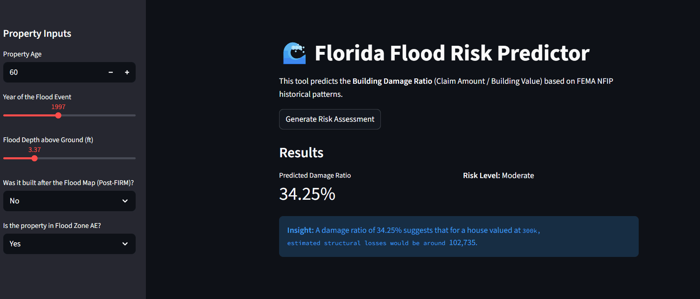

# 🌊 Florida Flood Damage Prediction (NFIP Data)

An end-to-end machine learning project predicting building damage ratios using FEMA's National Flood Insurance Program (NFIP) claims data.

## 🚀 Project Overview
This project uses FEMA data to predict building damage ratios for Florida properties at risk of flooding. Key challenges found were: data imbalance with many zero damage findings, high missingness (60%), and physical data anomalies.**

### Key Technical Achievements:
* **Data Audit & Cleaning:** Identified and removed physically impossible values (negative water depth/elevation) from central tendency calculations to prevent imputation bias.
* **Feature Engineering:** Engineered `age_of_property` and `elevation_is_missing` flags, which SHAP analysis confirmed as high predictors of resilience.
* **Model Interpretability:** Utilized **SHAP (Shapley Additive Explanations)** to validate that the model correctly learned the physics of flood risk (e.g., depth vs. damage) and the efficacy of Post-FIRM building codes.
* **Deployment:** Developed a **Streamlit** web application to provide real-time risk assessments based on the model's most influential features.

## 🛠️ Tech Stack
* **Modeling:** XGBoost Regressor
* **Interpretability:** SHAP
* **Deployment:** Streamlit, Joblib
* **Data Handling:** Pandas, NumPy, Scikit-Learn

## 📈 Model Insights
SHAP analysis revealed that **Year of Loss** and **Water Depth** are the primary drivers of loss, while **Post-FIRM construction** acts as a significant mitigator, reducing predicted damage ratios by an average of 5%.

## Data Source
This project utilizes the National Risk Index (NRI) dataset provided by FEMA.

[Link to FEMA NRI](https://www.fema.gov/openfema-data-page/fima-nfip-redacted-claims-v2)

## ✍️ Author
**Rossini Martyr** [https://www.linkedin.com/in/rossinimartyr/]

